# 🎓✨ Welcome to **EduLinkUp** ✨🎓

### *Where Learning Meets Building. Where Students Become Creators.*

---

### 🌟 **You're Here Because You're Special** 🌟

You're part of an **elite community** of **students, developers, and open-source enthusiasts** who believe learning should be:

<table>
<tr>
<td align="center">🎗️ <b>Practical</b></td>
<td align="center">🤠<b>Collaborative</b></td>
<td align="center">🎗️ <b>Accessible</b></td>
<td align="center">🎗️ <b>Impactful</b></td>
</tr>
</table>

---

## 🌱 **What is EduLinkUp?**

**EduLinkUp (ELU)** is a **student-driven educational revolution** - *by students, for students*.

> 🎯 **Our Mission**: Transform learners into builders through hands-on experience, real projects, and a thriving community.

### 🔥 **The EduLinkUp Way:**

```mermaid
graph LR
    A[📚 Learn] --> B[💻 Build]
    B --> C[🤝 Collaborate]
    C --> D[🌟 Showcase]
    D --> E[🎗️ Grow]
    E --> A
```

| 🎓 **Learn** | 🛠️ **Build** | 🌐 **Collaborate** | 📈 **Grow** |
|:---:|:---:|:---:|:---:|
| Curated resources | Real-world projects | Open source contribution | Portfolio & network |
| Clear concepts | GitHub-worthy code | Community support | Career opportunities |

## What We’re Building (Present & Future)

### 🔹 Skill-Based Internships (Live)
Free, structured internships focused on:
- Learning from curated resources
- Explaining concepts clearly
- Building real, GitHub-worthy projects
- Creating portfolio-ready proof of work  

Domains include:
**Web | Backend | Full Stack | AI/ML | Data | Cloud | IoT | Cyber Security | Blockchain | Python**

### 🔹 Open Source & Community Collaboration
This GitHub Organisation serves as a hub for:
- Collaborating during **WoC, SWoC, Hacktoberfest**, and similar events  
- Hosting capstone projects under organisation ownership  
- Sharing ideas, resources, and discussions  
- Long-term collaboration beyond individual events  

---

### 🔹 What’s Coming Next
We’re actively working towards:
- Community hackathons & coding events  
- Workshops & live learning sessions  
- Free study materials & guides  
- Open-source initiatives under ELU  
- Courses & learning tracks (free-first approach)  

---

## 🎉 **Why You're Here (Yes, YOU!)**

### 🌟 **You've Been Handpicked** 🌟

<table>
<tr>
<td width="50%">

### **You Were Invited Because:**

- You've **contributed to open source**
- You're **serious about learning & building**
- You're someone we want to **collaborate with**
- You **align with our values**

</td>
<td width="50%">

### 🎁 **You're Free To:**

- **Explore** discussions & projects
- **Contribute** to ongoing initiatives
- **Join** future events & programs
- **Stay connected** with the community

</td>
</tr>
</table>

> 💜 **Remember:** You're not just a member. You're a **co-creator** of this community.

## 🌐 **Connect With EduLinkUp**

### **Join Our Growing Ecosystem** 🌟

  

### **Follow Us on Instagram** 📸

  

---

### 🌱 **Join the Developer Community**

**Stay updated with everything happening in the EduLinkUp universe:**

---

### 📩 **Let's Connect Personally**

**Open to conversations about learning, open source, and community-building:**

---

## 💜 **Final Note** 💜

---

**EduLinkUp is still in its early chapters, and you're part of its origin story.**

<table>
<tr>
<td align="center">🎗️ <b>Curious?</b> Explore projects</td>
<td align="center">💡 <b>Motivated?</b> Start contributing</td>
<td align="center">🤠<b>Collaborative?</b> Join discussions</td>
<td align="center">🌟 <b>Ready?</b> Let's grow together</td>
</tr>
</table>

---

### ✨ **Let's Learn. Build. Grow. Together.** ✨

